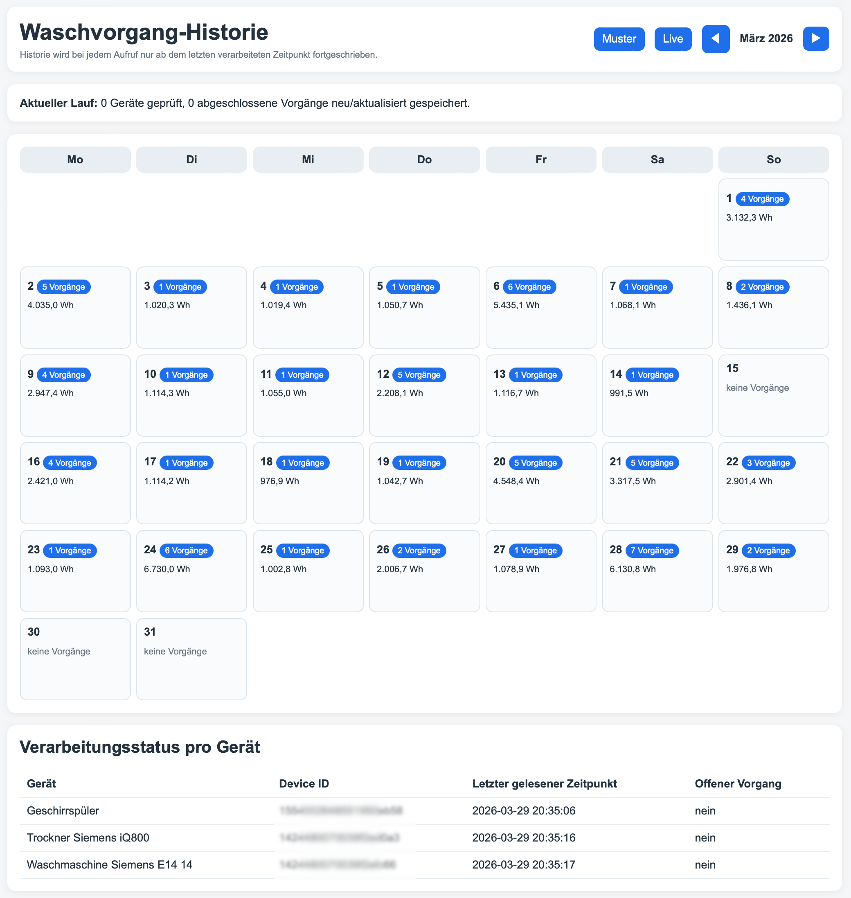
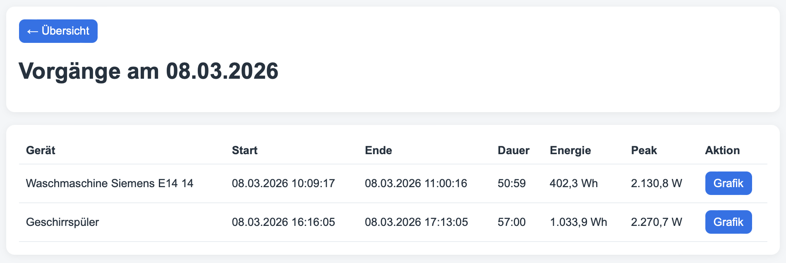
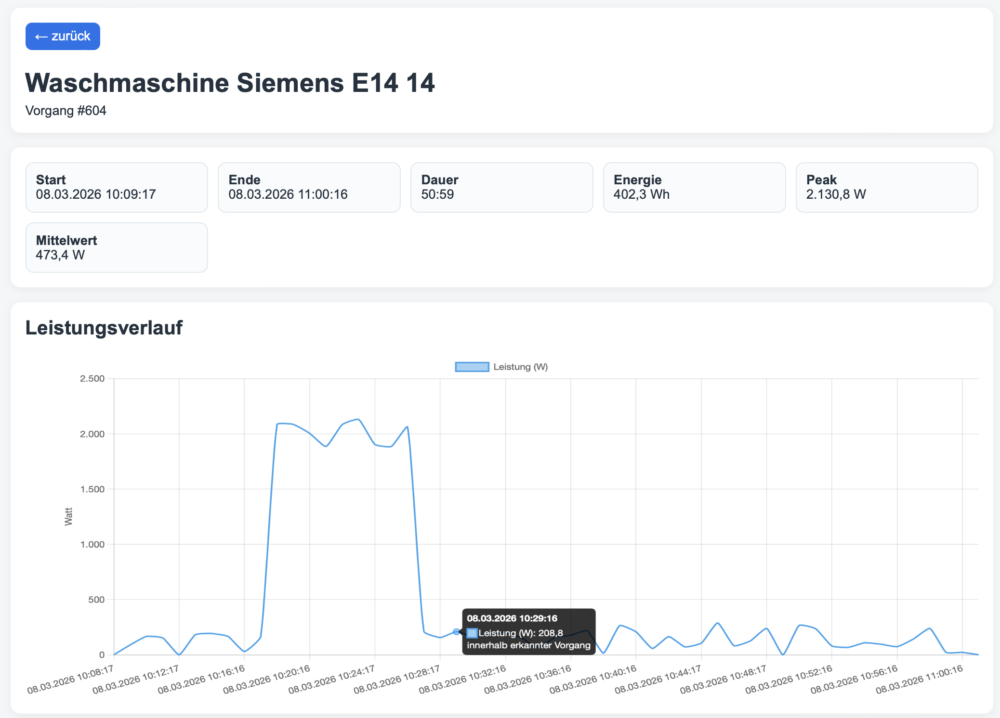
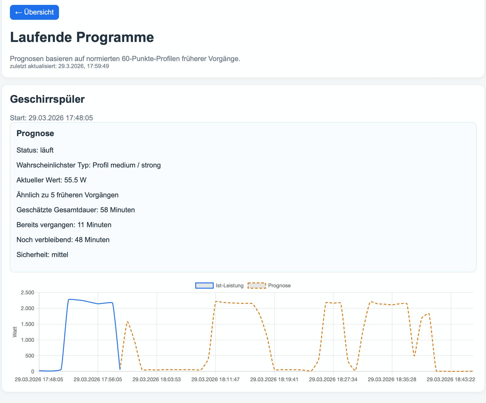
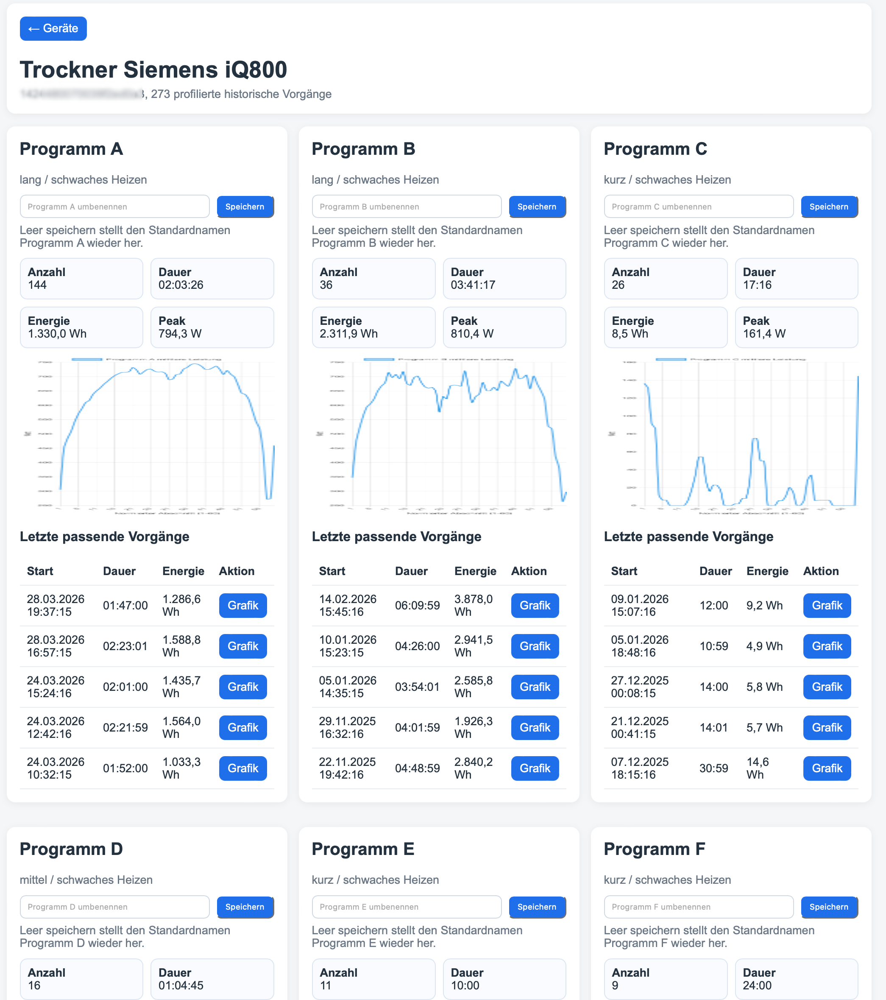

# power-cycle-monitor

PHP project for analyzing household appliance power usage, detecting cycles, visualizing history, and estimating remaining runtime from historical patterns.

## Overview

This project reads power measurements from a MySQL table and detects real appliance program runs such as:

- washing machine cycles
- dryer cycles
- dishwasher cycles

Detected runs are stored separately, visualized in the web UI, and used to build historical pattern profiles.  
These profiles can then be compared with a currently running cycle to estimate the remaining runtime.

---

## Screenshots

### Calendar overview


### Day view with detected cycles


### Cycle detail with power chart


### Live prediction for running cycles


### Historical pattern catalog


---

## Features

- incremental history processing
- cycle detection with idle-gap logic
- storage of detected cycles in separate tables
- normalized 60-step cycle profiles for historical comparison
- calendar-based history view
- daily list of detected cycles
- detailed chart per cycle
- live view for currently running programs
- historical pattern catalog per device
- remaining runtime estimation based on similar historical runs
- confidence indicator for predictions

---

## How it works

### 1. Raw power data
The source table contains measurements such as:

- timestamp
- current power
- device id
- device name

### 2. History processing
A history processor scans only new records since the last processed timestamp.

It detects when a program:

- starts
- pauses
- ends

Long inactive phases can be ignored, so only real program runs are stored as cycles.

### 3. Cycle storage
Detected cycles are saved with metadata such as:

- start time
- end time
- duration
- energy
- average power
- peak power
- sample count

### 4. Pattern generation
Each closed cycle is converted into a normalized 60-step profile.  
This makes it possible to compare cycles of different total durations.

### 5. Runtime prediction
For a currently running cycle, the project compares the partial live profile with similar historical finished cycles of the same device.

The prediction includes:

- detected profile / program group
- elapsed time
- expected total runtime
- remaining minutes
- confidence

---

## Project structure

```text
power-cycle-monitor/
├── config/
│   ├── app.php
│   └── app.sample.php
├── lib/
│   ├── db.php
│   ├── helpers.php
│   ├── history_processor.php
│   ├── pattern_builder.php
│   ├── predictor.php
│   └── ...
├── public/
│   ├── index.php
│   ├── day.php
│   ├── cycle.php
│   ├── live.php
│   ├── patterns.php
│   ├── device_patterns.php
│   └── chart_data.php
├── sql/
│   └── schema.sql
└── docs/
    └── images/
